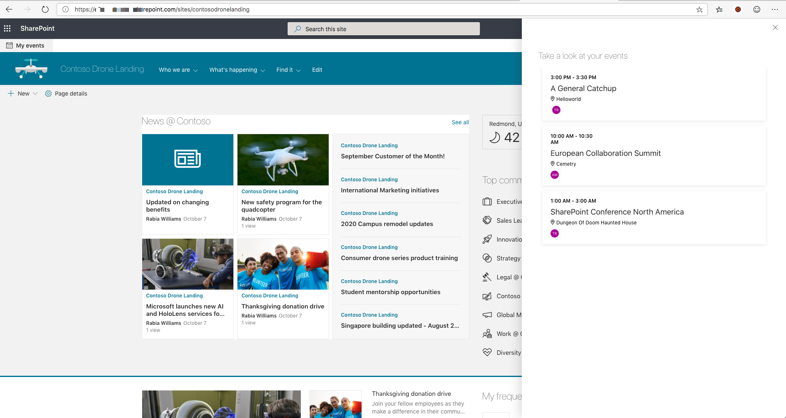

## ms-graph-toolkit-agenda-panel


## Summary
Sample SharePoint Framework application customizer which uses MicrosoftGraph Toolkit to display events for current user



## Used SharePoint Framework Version 


## Applies to

* [SharePoint Framework Extensions](https://dev.office.com/sharepoint/docs/spfx/extensions/overview-extensions)

## Solution

Solution|Author(s)
--------|---------
ms-graph-toolkit-agenda-panel| Rabia Williams ([@williamsrabia](https://twitter.com/williamsrabia))

## Version history

Version|Date|Comments
-------|----|--------
1.0|October 15, 2019|Initial release

## Disclaimer
**THIS CODE IS PROVIDED *AS IS* WITHOUT WARRANTY OF ANY KIND, EITHER EXPRESS OR IMPLIED, INCLUDING ANY IMPLIED WARRANTIES OF FITNESS FOR A PARTICULAR PURPOSE, MERCHANTABILITY, OR NON-INFRINGEMENT.**

---

## Minimal Path to Awesome

- Clone this repository
- Update the `pageUrl` properties in the **config/serve.json** file
  - The `pageUrl` should be a modern page
  - This property is only used during development in conjunction with the `gulp serve` command


## Debug URL for testing
Here's a debug querystring for testing this sample:

```
?debugManifestsFile=https%3A%2F%2Flocalhost%3A4321%2Ftemp%2Fmanifests.js&loadSPFX=true&customActions=%7B"01ca0b1a-7cfc-4ae6-a22f-5200131061cc"%3A%7B"location"%3A"ClientSideExtension.ApplicationCustomizer"%2C"properties"%3A%7B"testMessage"%3A"Test+message"%7D%7D%7D
```

Your URL will look similar to the following (replace with your domain and site address):
```
https://yourtenant.sharepoint.com/sites/yoursite?debugManifestsFile=https%3A%2F%2Flocalhost%3A4321%2Ftemp%2Fmanifests.js&loadSPFX=true&customActions=%7B"01ca0b1a-7cfc-4ae6-a22f-5200131061cc"%3A%7B"location"%3A"ClientSideExtension.ApplicationCustomizer"%2C"properties"%3A%7B"testMessage"%3A"Test+message"%7D%7D%7D
```

